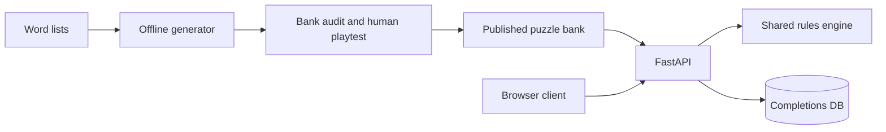

# Letter Alchemy

The backend lives in [`backend/`](backend/). `frontend/` is intentionally empty.

## Flow

See [backend/README.md](backend/README.md) for backend setup and rules.

Frontend integration: [backend/API.md](backend/API.md). Render deployment and puzzle cadence: [backend/DEPLOY.md](backend/DEPLOY.md).
